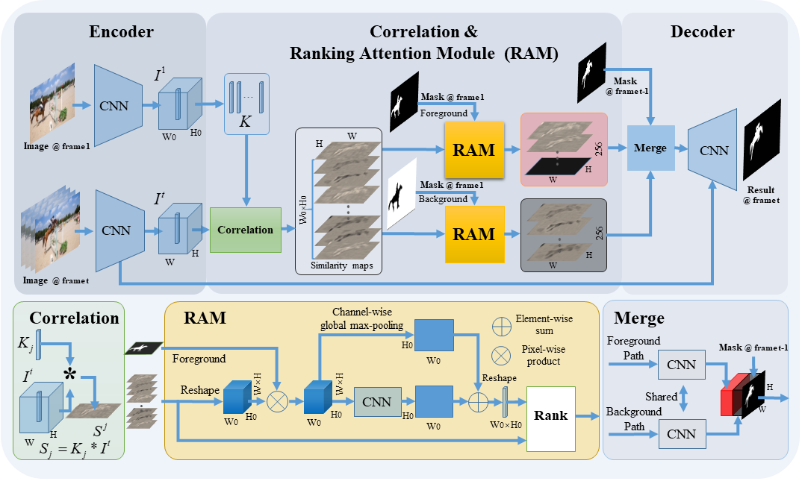

# [RANet: Ranking Attention Network for Fast Video Object Segmentation](https://github.com/Storife/RANet/) [(PDF)](https://github.com/Storife/RANet/raw/master/Ziqin_RANet_Ranking%20Attention%20Network%20for%20Fast%20VOS.pdf)

## Codes coming soon

# Contact Information

**[Ziqin Wang](https://github.com/Storife/)**  (ziqin.wang.edu at gmail dot com)

***
# RANet

## 1. Framework

# Downloads 
[Paper](https://github.com/Storife/RANet/raw/master/Ziqin_RANet_Ranking%20Attention%20Network%20for%20Fast%20VOS.pdf)

[Supplementary File](https://github.com/Storife/RANet/raw/master/Supp-Ziqin_RANet_Ranking%20Attention%20Network%20for%20Fast%20VOS.pdf)

Precomputed results:[Google drive](https://drive.google.com/folderview?id=1EwvDQiXAKAys_KVLTX5VRu8HggYiiUnl)

# Citation:

	@InProceedings{Ziqin2019RANet,
                    author = {Ziqin, Wang and Jun, Xu and Li, Liu and Fan, Zhu and Ling, Shao},
                    title = {RANet: Ranking Attention Network for Fast Video Object Segmentation},
                    booktitle = {ICCV},
                    month = {Oct},
                    year = {2019}
                    }
                    

