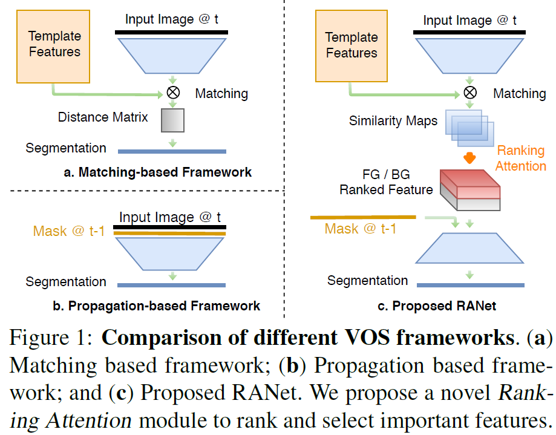
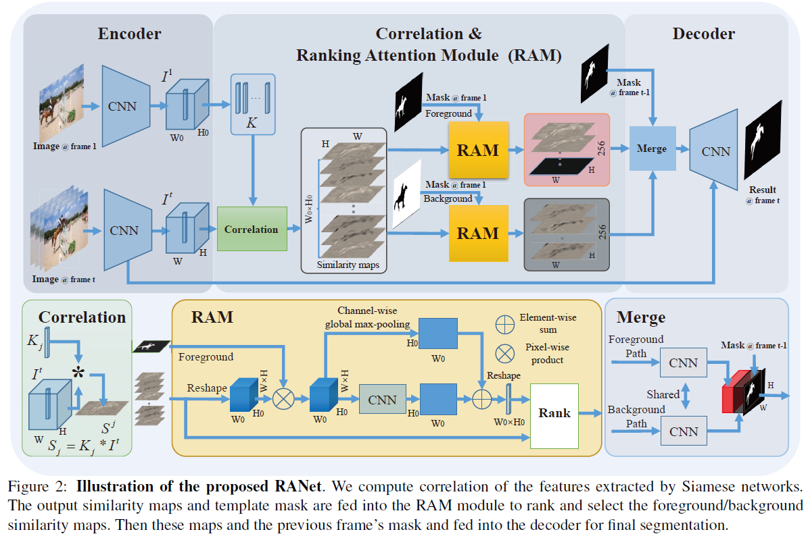
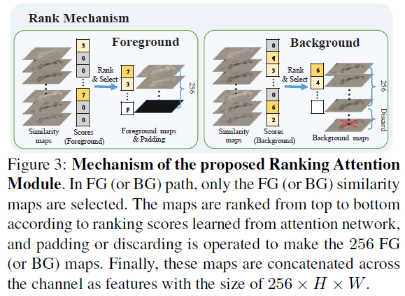

# [RANet: Ranking Attention Network for Fast Video Object Segmentation](https://github.com/Storife/RANet/) 

Ziqin Wang "RANet: Ranking Attention Network for Fast Video Object Segmentation", ICCV 2019, [official version](http://openaccess.thecvf.com/content_ICCV_2019/papers/Wang_RANet_Ranking_Attention_Network_for_Fast_Video_Object_Segmentation_ICCV_2019_paper.pdf), [arXiv](https://arxiv.org/abs/1908.06647)

***

# Contact Information

**[Ziqin Wang](https://github.com/Storife/)**  

## Contents
1. [Introduction](#introduction)
2. [Code](#code)
3. [Download](#download)
4. [Others](#others)
5. [Citation](#citation)

# Introduction

## 1. Overview

## 2. Framework

## 3. Ranking

# Code
## 1. Requirement
Pytorch (tested on 1.0.1 and 0.4.1)

torchvision = 0.2

## 2. Usage
1. Download the pretained model from this page.
2. Link DAVIS folder into datasets folder. (Please download [DAVIS 2017 version](https://davischallenge.org/davis2017/code.html).)
3. Run RANet.py

# Download
[Paper](https://arxiv.org/abs/1908.06647)

[Supplementary File](https://github.com/Storife/RANet/raw/master/Supp-Ziqin_RANet_Ranking%20Attention%20Network%20for%20Fast%20VOS.pdf)

Precomputed results:[Google drive](https://drive.google.com/folderview?id=1EwvDQiXAKAys_KVLTX5VRu8HggYiiUnl)

Pretrained models:[Baidu](https://pan.baidu.com/s/1_AVtp_IElsU4fr5Jmw9sRA), [Google drive](https://drive.google.com/folderview?id=1EwvDQiXAKAys_KVLTX5VRu8HggYiiUnl)

Previous Submission:[baidu](https://pan.baidu.com/s/1zBDpYcilRB28z_dTMukNkg?pwd=hoxm) (code: hoxm), [google](https://drive.google.com/file/d/1aeWp4nO7sZm-dlNZSDAdrlg4HWrcfDaw/view?usp=drive_link)

# Others

## Chinese version
[Discussion (Chinese)](https://zhuanlan.zhihu.com/p/79725498)

[VOS (Chinese)](https://zhuanlan.zhihu.com/c_1152262715987898368)

  

